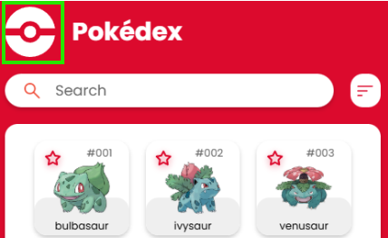
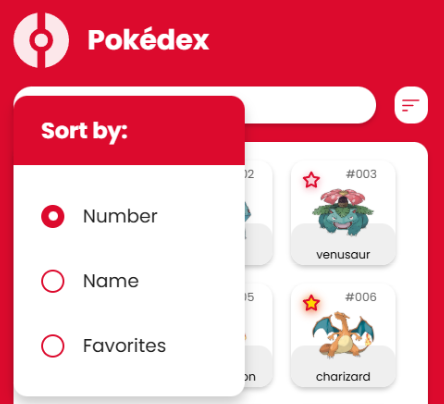
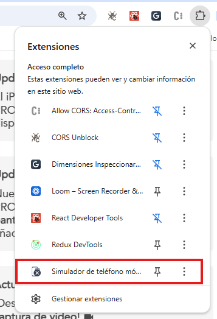
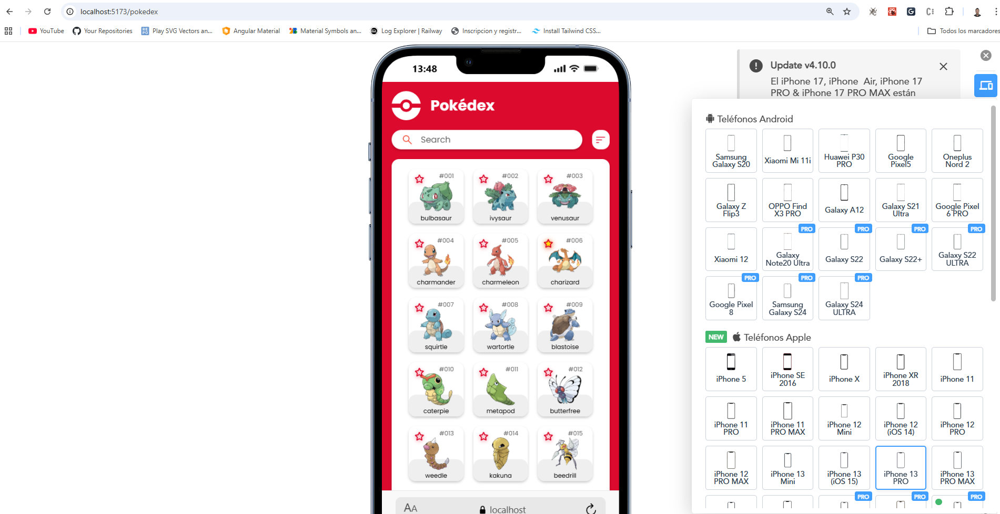

# 🎮 PokeWeb - Pokédex Web Application

Una aplicación web moderna y responsive para explorar información detallada de Pokémon, construida con React, TypeScript y GraphQL.

🌐 **Aplicación en vivo:** [https://pokewebb.netlify.app/pokedex](https://pokewebb.netlify.app/pokedex)

## 📋 Tabla de Contenidos

- [Características](#-características)
- [Tecnologías](#-tecnologías)
- [Instalación](#-instalación)
- [Scripts Disponibles](#-scripts-disponibles)
- [Arquitectura del Proyecto](#-arquitectura-del-proyecto)
- [Estructura de Carpetas](#-estructura-de-carpetas)
- [CSS Modules](#-css-modules)
- [Testing](#-testing)
- [Despliegue](#-despliegue)
- [Visualización del Menú](#-visualización-del-menú)
- [Visualización desde el Navegador como Teléfono](#-visualización-desde-el-navegador-como-teléfono)

## ✨ Características

- 🔍 **Búsqueda de Pokémon** por nombre o número
- 📊 **Ordenamiento** por número, nombre o favoritos
- ⭐ **Sistema de favoritos** con persistencia local
- 🎨 **Diseño responsive** adaptado a diferentes dispositivos
- 🚀 **Optimización de rendimiento** con lazy loading de imágenes
- 💾 **Caché inteligente** para reducir peticiones al API
- 🎯 **Navegación fluida** entre lista y detalles de Pokémon

## 🛠 Tecnologías

### Core
- **React 19.2** - Biblioteca de UI
- **TypeScript 5.9** - Tipado estático
- **Vite 7.2** - Build tool y dev server

### Estado y Datos
- **Zustand 5.0** - Gestión de estado global
- **Apollo Client 4.0** - Cliente GraphQL con caché
- **GraphQL** - API de PokeAPI

### Routing
- **React Router DOM 7.11** - Navegación SPA


### Estilos
- **CSS Modules** - Estilos con scope local
- **CSS Variables** - Sistema de diseño consistente

## 📦 Instalación

### Prerrequisitos

- **Node.js** >= 18.x
- **npm** >= 9.x (o yarn/pnpm)

### Pasos de Instalación

1. **Clonar el repositorio** (o descargar el proyecto)
   ```bash
   git clone <repository-url>
   cd PokeWeb
   ```

2. **Instalar dependencias**
   ```bash
   npm install
   ```

3. **Iniciar el servidor de desarrollo**
   ```bash
   npm run dev
   ```

4. **Abrir en el navegador**
   ```
   http://localhost:5173
   ```

## 🚀 Scripts Disponibles

| Comando | Descripción |
|---------|-------------|
| `npm run dev` | Inicia el servidor de desarrollo con hot-reload |
| `npm run build` | Compila el proyecto para producción |
| `npm test` | Ejecuta tests en modo watch |

## 🏗 Arquitectura del Proyecto

El proyecto sigue una **arquitectura modular** basada en Atomic Design y principios de separación de responsabilidades:

### Patrones de Diseño

1. **Atomic Design**
   - **Atoms**: Componentes básicos reutilizables (Button, Input, Card)
   - **Molecules**: Componentes compuestos (PokemonCard, Menu, AboutPokemon)
   - **Pages**: Vistas completas (HomePage, PokemonDetailPage)

2. **Separación de Responsabilidades**
   - **API Layer**: Cliente GraphQL y queries
   - **State Management**: Stores de Zustand
   - **Presentation Layer**: Componentes React
   - **Routing**: Configuración de rutas

3. **Optimizaciones**
   - **Caché de Apollo Client**: Reduce peticiones al API
   - **Lazy Loading**: Carga imágenes bajo demanda
   - **Code Splitting**: División automática de código con Vite
   - **CSS Modules**: Estilos encapsulados por componente


## 📁 Estructura de Carpetas

```
PokeWeb/
├── public/                 # Archivos estáticos
│   ├── pokeball.svg
│   └── _redirects         # Configuración de Netlify
│
├── src/
│   ├── api/               # Capa de API
│   │   ├── client.ts      # Configuración de Apollo Client
│   │   ├── queries/       # Queries GraphQL
│   │   │   ├── pokemon.queries.ts
│   │   │   └── index.ts
│   │   └── types/         # Tipos TypeScript
│   │       └── pokemon.types.ts
│   │
│   ├── assets/            # Recursos estáticos
│   │   ├── Icons/         # Iconos SVG
│   │   └── Images/        # Imágenes
│   │
│   ├── components/         # Componentes React
│   │   ├── atoms/         # Componentes atómicos
│   │   │   ├── Button/
│   │   │   ├── Card/
│   │   │   ├── InputSearch/
│   │   │   ├── LazyImage/
│   │   │   ├── StatItem/
│   │   │   └── TypeSection/
│   │   └── molecules/     # Componentes moleculares
│   │       ├── AboutPokemon/
│   │       ├── Menu/
│   │       └── PokemonCard/
│   │
│   ├── hooks/            # Custom hooks
│   │   ├── usePokemon.ts
│   │   └── usePokemonList.ts
│   │
│   ├── pages/            # Páginas/Vistas
│   │   ├── HomePage/
│   │   ├── PokemonDetailPage/
│   │   └── ContentLoad/
│   │
│   ├── router.tsx        # Configuración de rutas
│   │
│   ├── store/            # Estado global (Zustand)
│   │   ├── slices/
│   │   │   ├── pokemonSlice.ts      # Filtros y ordenamiento
│   │   │   ├── favoritesSlice.ts    # Favoritos
│   │   │   └── descriptionsSlice.ts # Caché de descripciones
│   │   └── index.ts
│   │
│   ├── styles/           # Estilos globales
│   │   ├── variables.css # Variables CSS
│   │   └── icons/        # Iconos PNG (legacy)
│   │
│   ├── test/             # Configuración de tests
│   │   ├── setup.ts
│   │   ├── utils/
│   │   │   └── test-utils.tsx
│   │   └── vitest.d.ts
│   │
│   ├── index.css         # Estilos globales
│   ├── main.tsx         # Punto de entrada
│   └── vite-env.d.ts    # Tipos de Vite
│
├── .eslintrc.js         # Configuración de ESLint
├── index.html           # HTML principal
├── netlify.toml         # Configuración de Netlify
├── package.json         # Dependencias y scripts
├── tsconfig.json        # Configuración de TypeScript
├── vite.config.ts       # Configuración de Vite
└── vitest.config.ts     # Configuración de Vitest
```

### Descripción de Carpetas Principales

#### `/src/api`
Contiene toda la lógica relacionada con la API:
- **client.ts**: Configuración de Apollo Client con caché optimizado
- **queries/**: Definiciones de queries GraphQL
- **types/**: Interfaces TypeScript para los datos de la API

#### `/src/components`
Componentes organizados por Atomic Design:
- **atoms/**: Componentes básicos e indivisibles (Button, Input, etc.)
- **molecules/**: Componentes compuestos que combinan atoms

#### `/src/store`
Estado global gestionado con Zustand:
- **slices/**: Stores modulares por funcionalidad
- Cada slice maneja su propio dominio (filtros, favoritos, descripciones)

#### `/src/pages`
Vistas principales de la aplicación:
- **HomePage**: Lista de Pokémon con búsqueda y filtros
- **PokemonDetailPage**: Vista detallada de un Pokémon
- **ContentLoad**: Componente de error/loading

#### `/src/hooks`
Custom hooks para lógica reutilizable:
- **usePokemon**: Hook para obtener datos de un Pokémon
- **usePokemonList**: Hook para obtener listas de Pokémon

## 🎨 CSS Modules

El proyecto utiliza **CSS Modules** para proteger y encapsular los estilos de cada componente. Esto previene conflictos de nombres de clases y mejora la mantenibilidad del código.


## 🧪 Testing

El proyecto incluye una suite de testing completa usando **Vitest** y **React Testing Library**.

### Ejecutar Tests

```bash
# Modo watch
npm test

# Ejecutar una vez
npm run test:run

# UI interactiva
npm run test:ui

```

### Estructura de Tests

Los tests están colocalizados con los componentes:

```
src/
  components/
    atoms/
      Button/
        Button.tsx
        Button.test.tsx  ← Test del componente
```

### Ejemplo de Test

```typescript
import { describe, it, expect } from 'vitest'
import { render, screen } from '@testing-library/react'
import Button from './Button'

describe('Button', () => {
  it('renders correctly', () => {
    render(<Button onClick={() => {}}>Click me</Button>)
    expect(screen.getByText('Click me')).toBeInTheDocument()
  })
})
```

## 🚀 Despliegue

La aplicación está desplegada en **Netlify** y se actualiza automáticamente con cada push a la rama principal.

### Configuración de Netlify

- **Build command**: `npm run build`
- **Publish directory**: `dist`
- **Node version**: 20

### Variables de Entorno

No se requieren variables de entorno para el funcionamiento básico. La aplicación usa la API pública de PokeAPI GraphQL.

## 📝 Notas Adicionales

### Optimizaciones Implementadas

1. **Caché de Apollo Client**: Configurado con `cache-first` para minimizar peticiones
2. **Lazy Loading de Imágenes**: Componente `LazyImage` con Intersection Observer
3. **Persistencia Local**: Favoritos y descripciones se guardan en localStorage

### Navegación

- `/pokedex` - Página principal con lista de Pokémon
- `/pokemon/:id` - Detalle de un Pokémon específico
- Cualquier ruta no válida redirige a `/pokedex`

## 📋 Visualización del Menú

Para visualizar el menú de ordenamiento, puedes hacer clic en la **pokebola** ubicada al lado del título "Pokédex" en la parte superior de la página. Al hacer clic, se desplegará un menú con las siguientes opciones de ordenamiento:

- **Number**: Ordena los Pokémon por número (ID)
- **Name**: Ordena los Pokémon alfabéticamente por nombre
- **Favorites**: Muestra solo los Pokémon marcados como favoritos

El menú se cierra automáticamente al seleccionar una opción.

### Capturas de Pantalla



*Menú desplegado mostrando las opciones de ordenamiento*




*Vista del menú con animación de despliegue*

## 📱 Visualización desde el Navegador como Teléfono

Para probar la aplicación en diferentes dispositivos móviles directamente desde el navegador, puedes instalar una extensión de Chrome que simula diferentes modelos de teléfonos.

### Instalación de la Extensión

1. **Instala la extensión**: [Mobile Simulator - Responsive Testing Tool](https://chromewebstore.google.com/detail/mobile-simulator-responsi/ckejmhbmlajgoklhgbapkiccekfoccmk?hl=es)

### Uso de la Extensión

1. **Abre la extensión**: Haz clic en el icono de extensiones en tu navegador y selecciona "Simulador de teléfono Móvil"

   

2. **Selecciona el modelo**: Se abrirá la pantalla del simulador. Escoge la opción de cambiar modelo y podrás probar la aplicación con diferentes dispositivos móviles

   

### Alternativas

También puedes usar las **DevTools del navegador** (F12) y activar el modo de dispositivo móvil (Ctrl+Shift+M) para simular diferentes tamaños de pantalla sin necesidad de extensiones.

---


